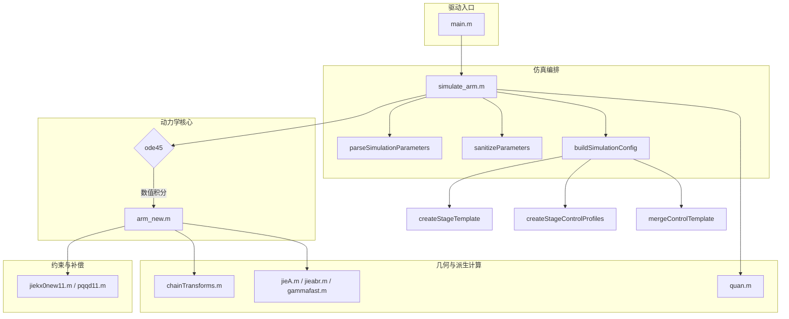

# 总览

## 调用关系总览



## 模型更新要点

- 主入口 `main.m` 仅负责调用 `simulate_arm`，所有参数改动都通过 `simulate_arm` 的结构体或“名称-值对”接口完成。
- `simulate_arm` 统一管理多级柔性臂的参数装配、求解时间轴以及可视化流程，默认支持 1~N 级串联。
- 动力学核心 `arm_new` 完全参数化：按配置自动装配质量矩阵、控制力以及级间约束，不再依赖硬编码的单级假设。
- `quan` 改写为支持多级柔性臂的数据派生，首选返回结构体，兼容旧版 12 个向量输出。
- 新增 `chainTransforms` 计算串联姿态链，动力学与可视化共享同一几何描述。
- 控制与外力模块支持常量、函数句柄以及表达式三种输入形式，可按级别单独覆写。

---

# 仿真入口与配置

## `main.m`

```matlab
close all;
clear;
clc;

simulate_arm();
```

- 该脚本提供“一键运行”体验。
- 自定义参数时，推荐直接调用 `simulate_arm('stageCount', 6, 'enablePlots', false, ...)`，无需修改 `main.m`。

## `simulate_arm.m`

`simulate_arm` 是新的顶层调度器，内部流程如下：

1. **解析参数**：`parseSimulationParameters` 接受结构体或名称-值对，合并默认值。
2. **清洗参数**：`sanitizeParameters` 完成数值合法性与类型检查。
3. **构造配置**：`buildSimulationConfig` 生成时间轴、初始状态、每级模板以及控制策略。
4. **数值积分**：调用 `ode45`，求解 `arm_new(t, q, config)`。
5. **派生量计算**：使用 `quan` 生成各级盘心与姿态数据。
6. **可视化**（可选）：绘制关节位移、盘心投影和三维轨迹。
7. **结果返回**：输出 `result` 结构体，便于外部程序继续处理。

### 参数接口

`simulate_arm` 支持下列参数（括号内为默认值）：

| 名称 | 类型 | 说明 |
| ---- | ---- | ---- |
| `stageCount` (`8`) | 标量整数 | 串联级数，自动复制模板并设置偏转角 |
| `duration` (`10`) | 正标量 | 仿真总时长（秒） |
| `timeStep` (`0.01`) | 正标量 | 保存数据的采样步长，用于构造 `timeVector` |
| `derivativeTimeStep` (`1e-4`) | 正标量 | 有限差分用于雅可比与约束漂移修正的时间步长 |
| `initialHeight` (`0.35`) | 标量 | 每级杆件的初始长度（米） |
| `initialState` (`[]`) | 向量 | 若提供，长度须为 `6*stageCount`，按 `[h; hd]` 排列 |
| `orientationOffset` (`pi/3`) | 标量 | 相邻级绕 z 轴的布置偏角，默认 60° |
| `enablePlots` (`true`) | 逻辑值 | 是否输出 MATLAB 图像 |
| `customControlProfiles` (`[]`) | `cell` | 每级可覆写控制参数的单元数组 |
| `customForceMatrix` (`[]`) | 矩阵 / `cell` / 字符串 | 外力输入覆写，详见下节 |

> **名称-值对示例**
>
> ```matlab
> result = simulate_arm('stageCount', 4, ...
>                      'enablePlots', false, ...
>                      'customForceMatrix', [0.5, 0, 0; NaN, NaN, NaN; 0.15, 0.08, 0.02; 0.1, 0, 0]);
> ```

### 控制与外力定制

- 每一级的控制模板来自 `createStageTemplate`。
  - `gain`、`stiffness`、`damping` 组合为线性反馈律。
  - `target` 默认按级数线性漂移。
  - `externalAmplitude/frequency/phase/direction` 定义缺省正弦激励。
- `createStageControlProfiles` 将外部 `customControlProfiles` 合并到模板。
- `customForceMatrix` 支持三种写法：
  1. **数值矩阵**（`stageCount × 3`）：直接施加常量广义力；用 `NaN` 表示保持默认。
  2. **单元数组**：
     - 长度为 3 的数值向量 → 常量力；
     - 长度为 3 的字符串/字符向量数组 → 表达式列向量；
     - 单个字符串/字符向量 → 需返回 3×1 向量的表达式；
     - 函数句柄 `@(t, stageState) ...` → 自定义时变力。
  3. **字符串**：全局共享的表达式，需返回 3×1 向量。
- 所有覆写都会通过 `finalizeCustomInput` 转成函数句柄，保证在 `arm_new` 内统一调用。

### 结果结构体

`simulate_arm` 返回的 `result` 包含：

- `time`：时间向量，与 `config.timeVector` 相同。
- `jointDisplacement` / `jointVelocity`：尺寸为 `[N × (3·stageCount)]` 的矩阵。
- `stagePositions` / `stageVelocities`：尺寸为 `[N × 3 × stageCount]` 的张量。
- `finalPosition` / `finalVelocity`：末级盘心的位置与速度。
- `orientation` / `orientationRate`：末级姿态三分量与角速度。
- `stageCount`、`duration`、`parameters` 等元数据。

### 可视化输出

当 `enablePlots=true` 时，自动生成：

1. **关节位移子图**：按级别与杆序绘制（单位 mm）。
2. **盘心三轴曲线**：展示每一级在 x/y/z 方向的随时间变化。
3. **三维轨迹**：叠加所有级的空间轨迹，并在终端散点上着色。

---

# 动力学核心

## `arm_new.m`

- 输入：时间 `t`、状态向量 `qh`（`[h; hd]`）、配置结构 `config`。
- 输出：导数 `dq = [hd; hdd]`。
- 计算流程：
  1. **状态整形**：把 `qh` 改写为 `stageDisplacement` 与 `stageVelocity`。
  2. **几何链生成**：`chainTransforms` 结合级别偏角与局部齐次变换，得到各级基座/顶盘位姿。
  3. **雅可比有限差分**：对每个自由度做扰动，构造基座、顶盘位置雅可比及顶盘姿态雅可比。
  4. **质量矩阵装配**：按级叠加平动、转动惯量贡献，并将顶盘惯量旋转到世界坐标。
  5. **控制力**：`computeControlForce` 基于反馈参数、自定义输入生成广义力。
  6. **级间约束**：相邻级的连接约束 `phi=0` 通过预测步构造 `C` 与漂移项 `\dot{C}\dot{q}`。
  7. **线性系统求解**：无约束时直接解 `M a = Q`；有约束时求解增广系统 `[[M, C^T]; [C, 0]]`。
  8. **导数组装**：把加速度重塑为 `[3 × stageCount]`，拼接为导数向量。

### 数值稳健性

- `regularizeSymmetricMatrix` 对质量矩阵与增广矩阵做对称化并添加 `εI`。
- `solveLinearSystem` 根据条件数自动选择 `\` 或伪逆。
- `sanitizeMatrix`、`sanitizeVector` 清理有限差分产生的 `NaN/Inf`。

---

# 几何链与派生量

## `chainTransforms.m`

- 依次乘以级别偏角 `R_z(θ)` 与局部变换 `jieA`，返回结构数组：
  - `baseTransform` / `topTransform`
  - `basePosition` / `topPosition`
  - `baseRotation` / `topRotation`
- 为 `arm_new`（动力学）与 `quan`（派生量）提供统一的几何数据。

## `jieA.m` 及相关函数

- `jieA`：根据 `(h1, h2, h3, h0, L0)` 构造单级齐次变换。
- `cosbeta1hanshu` & `gammafast`：计算中间角度和补偿量。
- `jieabr`：封装 `(α, β, γ)` 的计算，供姿态映射与调试使用。
- `pqqd11`、`jiekx0new11`：延续旧版的补偿/约束计算逻辑，为拉格朗日方程提供附加项。

## `quan.m`

- 针对多级柔性臂重写：
  - 对每个时间步重建串联几何，并使用有限差分生成速度。
  - 默认返回结构体 `{stagePositions, stageVelocities, finalPosition, finalVelocity, orientation, orientationRate, stageCount}`。
  - 若请求多个输出参数，仍可按旧版次序返回 12 个向量。

---

# 参数模板与覆写

## `createStageTemplate`

默认参数：

- 几何：`h0 = 0.35 m`，`L0 = 0.055 m`
- 质量：杆体 `1.774 kg`，顶盘 `9.08 kg`，惯量对角线 `[3.6826e-2, 3.6826e-2, 7.2966e-2] kg·m²`
- 控制：`gain = 0`、`stiffness = -12.2`、`damping = 18.3`
- 缺省目标：`[-0.08; 0.1; 5.0] m`
- 缺省外力：幅值 `0.1045`、频率 `π rad/s`、相位 `0`，方向 `[1; 0; 0]`

`buildSimulationConfig` 会：

1. 复制模板 `stageCount` 份。
2. 依据 `orientationOffset` 设置 `orientationAngle = (stageIdx-1) * offset`。
3. 若未提供 `initialState`，生成默认 `[h0; …; h0; 0; …; 0]`。
4. 调用 `createStageControlProfiles` 合并外部覆写。

## `customControlProfiles`

- 以 `cell` 数组传入，每个元素是结构体，可包含：`target`、`customInput`、`externalDirection`、`gain`、`stiffness`、`damping` 等字段。
- 若未覆写，默认行为：
  - `target` 随级累加 `[0.005; 0.004; 0.06] * (stageIdx-1)`。
  - 正弦外力幅值、频率、相位分别按 `1 + 0.08(stageIdx-1)`、`1 + 0.05(stageIdx-1)`、`(stageIdx-1)*π/10` 递增。

---

# 输出与后处理建议

1. **MATLAB 脚本**：直接读取 `result` 结构体；如需更细粒度数据，可再次调用 `quan`。
2. **Python MATLAB Engine**：`simulate_arm` 返回的结构体仅含数值数组，便于转为 NumPy。
3. **多场景复用**：
   - 调整 `stageCount` 即可在单级和多级之间切换。
   - 通过 `customForceMatrix` 或 `customControlProfiles` 组合不同驱动策略。

### 示例：单级 + 自定义正弦力

```matlab
params = struct();
params.stageCount = 1;
params.enablePlots = true;
params.customForceMatrix = { @(t, s) [0.2 * sin(2*pi*t); 0; 0] };
result = simulate_arm(params);
```

---

# 数值稳定性与调试

- `timeStep` 控制数据输出密度，可根据后处理需求调整。
- `derivativeTimeStep` 影响有限差分精度；取值过小会放大噪声，过大则可能增加约束漂移。
- 若求解发散，可：
  1. 增大 `derivativeTimeStep` 至 `5e-4`~`1e-3`；
  2. 降低 `stageCount`，逐级排查；
  3. 检查自定义输入是否始终返回有限的 3×1 向量；
  4. 暂时禁用外力覆写，验证基础模型稳定性。

---

# 常见问题 FAQ

1. **如何只运行部分级？** 设置 `stageCount`，其他配置自动匹配。
2. **如何关闭图像输出？** 传入 `enablePlots=false`。
3. **还能用旧版 `quan` 的 12 输出接口吗？** 可以，`quan` 会根据输出参数个数保持兼容。
4. **如何叠加常量力与表达式力？** 在 `customControlProfiles` 中提供函数句柄，内部自行组合常量与时变项。
5. **Python UI 如何接入？** 与旧版一致，只需调用 `result = simulate_arm(params);`，再把数值字段转为所需格式。

---

# 结语

新的多级柔性臂模型把“参数 → 动力学 → 可视化”完整封装在 `simulate_arm` 流程中，既保留旧版拉格朗日求解的可靠性，又提供更灵活的控制与外力定制接口。阅读本文档后，可按需调整级数、外力和目标轨迹，快速构建不同的仿真场景。
